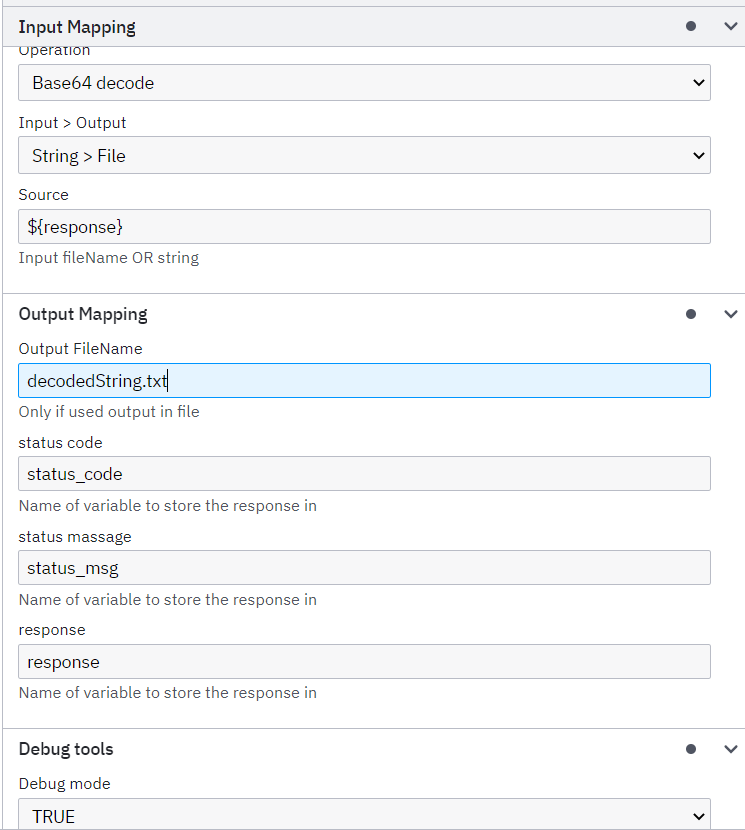
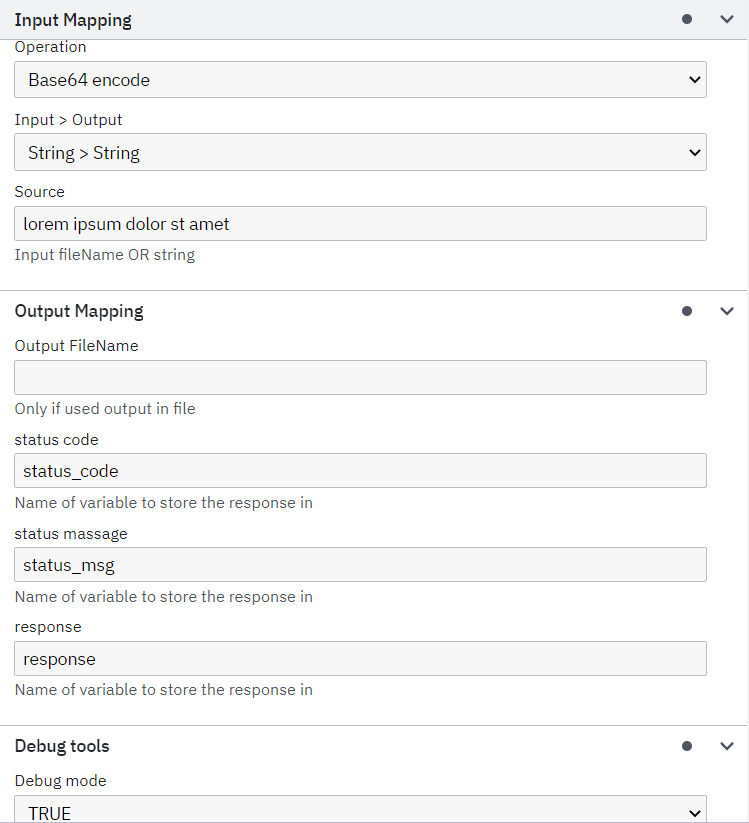

# Camunda 7 Base64 converter
Base64 Converter (Connector) for Camunda 7

### Recommended Requirement:
- Maven: latest or 3.3.*+
- JDK:   1.8 (52)

## Deploying the Base64 converter Connector

```bash
git clone https://github.com/codot-pro/base64-converter-c7
cd base64-converter-c7
mvn clean install
```

After build, we can find .jar in ./target/ folder

## Run

#### Maven dependency
You can create a **Maven** project and add a **dependency** to run the connector

    <dependency>
        <groupId>com.codot.camundaconnectors.converter</groupId>
        <artifactId>base64-converter-c7</artifactId>
        <version>0.1.0-SNAPSHOT</version>
    </dependency>

#### Start SpringBootApplication
```bash
mvn exec:java -Dexec.mainClass="com.codot.camundaconnectors.converter.Main"
```

#### Add .jar to Camunda 7 dir
After build, we can find .jar in ./target/ folder.
Place the .jar with other .jars and don't forget to add the missing libraries as needed.

## Connector template

To add a template to Camunda Modeler, you need to open the application
**modeler_root_folder/resources/element-templates** and put inside the template from
**base64-converter-c7/element-templates** with the name **base64-converter-c7.json**.

Reload the application, and you will be able to assign a template.

### Input data

- Operation
  - Base64 encode (UTF-8  ->  Base64)
  - Base64 decode (Base64  ->  UTF-8)
- Source
  - String to encode or decode

### Output data

> It is important to fill in **all fields**
- Status code:
    - 400 - client error (Invalid headers/method)
    - 500 - server error
    - 504 - timeout error
    - other code returned by the server
- Status msg
- Response can be
    - body (if it is possible to parse it)
    - file (it will be written to the TEMP directory with the specified file name)

## Example

This example can be found in **src/main/resources/test-template.bpmn**

- ### Decode



- ### Encode

